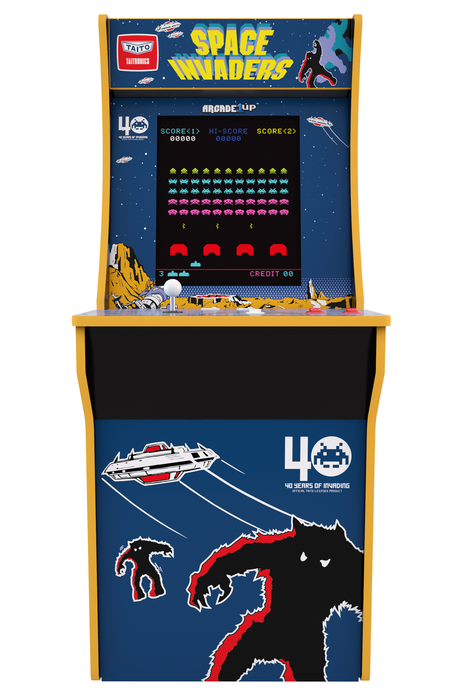

<!-- PROJECT LOGO -->
[![LinkedIn][linkedin-shield]][linkedin-url]
<br />
<p align="center">
  <a href="https://github.com/ProgrammingLuis/Intel8080">
    
  </a>

  <h3 align="center">Intel 8080 Microprocessor Emulator</h3>

  <p align="center">
    <br />
    An emulator for the Space Invaders Arcade Machine.
    <br />
    <br />
    ·
    <a href="https://github.com/ProgrammingLuis/Intel8080/issues">Report Bug</a>
    ·
    <a href="https://github.com/ProgrammingLuis/Intel8080/issues">Request Feature</a>
  </p>
</p>


<!-- TABLE OF CONTENTS -->
## Table of Contents

* [About the Project](#about-the-project)
  * [Built With](#built-with)
* [Getting Started](#getting-started)
  * [Prerequisites](#prerequisites)
  * [Installation](#installation)
* [Usage](#usage)
* [Roadmap](#roadmap)
* [Co-author](#co-author)
* [License](#license)
* [Contact](#contact)
* [Acknowledgements](#acknowledgements)


<!-- ABOUT THE PROJECT -->
## About The Project

I have always wondered how emulators worked and making my own is my way of learning about them. 

Things I have learned about while working on this project:
* Assembly and how to make a disassembler.
* CPUs/microprocessors
* Hardware - displays/inputs
* Better debugging practices :smile:

This is just the start of my emulation journey. So I'll be emulating more hardware systems in the near future. Please let me know about any bugs/issues so that I can get better at this.

A list of commonly used resources that I found helpful are listed in the acknowledgements.

### Built With
This was all done in Community Visual Studio 2019. 
* C++
* SDL (Simple DirectMedia Layer) library

<!-- GETTING STARTED -->
## Getting Started

For now, Intel 8080 compiled files will run, but they are waiting for input from external hardware.This will be implemented soon.

### Prerequisites

To run this program you will need to compile the files in Visual Studio.
* Visual Studio

### Installation
```sh
Visual C++
* To build this project in Visual C++, first download disassembler.h, disassembler.cpp, and CPU.cpp, then build and run the program.
```

<!-- USAGE EXAMPLES -->
## Usage

When finished, the program will be able to run a Space Invaders (1978) ROM.

<!-- ROADMAP -->
## Roadmap

See the [open issues](https://github.com/ProgrammingLuis/Intel8080/issues) for a list of proposed features (and known issues).


<!-- CO-AUTHOR -->
## Co-author

[F Banda](https://github.com/f-banda)


<!-- LICENSE -->
## License

Distributed under the GNU License. See `LICENSE` for more information.

<!-- CONTACT -->
## Contact

Luis Hernandez - hluis@umich.edu

Project Link: [https://https://github.com/ProgrammingLuis/Intel8080](https://https://github.com/ProgrammingLuis/Intel8080)


<!-- ACKNOWLEDGEMENTS -->
## Acknowledgements
* [Emulator 101](http://emulator101.com/)
* [superzazu's emulator](https://github.com/superzazu/8080)


<!-- MARKDOWN LINKS & IMAGES -->
<!-- https://www.markdownguide.org/basic-syntax/#reference-style-links -->
[linkedin-shield]: https://img.shields.io/badge/-LinkedIn-black.svg?style=flat-square&logo=linkedin&colorB=555
[linkedin-url]: https://linkedin.com
